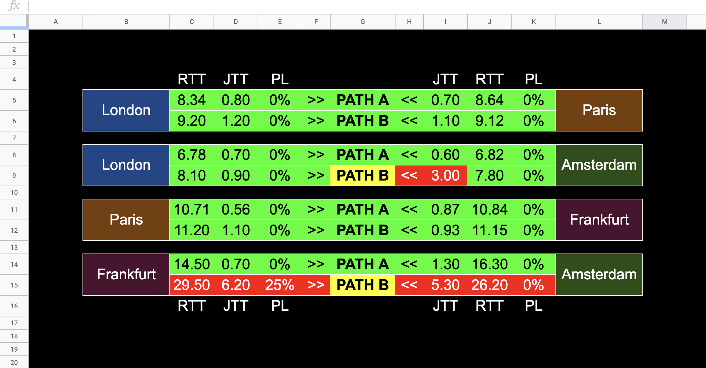

# Pingsheet



## Introduction
Pingsheet is a cloud based latency and packet loss monitoring platform built on
top of Google Sheets.

A Google Sheet is used to configure a swarm of hosts with targets they should
ping, the hosts run the pings and add the results back into the Google Sheet.

As the data is in Google Sheets it makes it very simple and flexible to create
dashboards using conditional formatting and charts.

Due to limitations on how big a sheet can become this is best suited for short
term data.

## Usage

1. [Start by creating the required Google Sheets API credentials](#Create-Google-Credentials)
2. [Then import the template sheet into Google Sheets](#Google-Sheet)
3. [Configure your hosts, settings and targets in the Google Sheet](#Config)
4. Download and install the latest executable for your host platform
   * Mac OS
     ```
     wget https://github.com/adamkirchberger/pingsheet/releases/latest/download/pingsheet_Darwin_x86_64.tar.gz && \
     tar xvzf pingsheet_Darwin_x86_64.tar.gz pingsheet && \
     xattr -dr com.apple.quarantine pingsheet && \
     mv pingsheet /usr/local/sbin/
     ```
   * Linux
     ```
     wget https://github.com/adamkirchberger/pingsheet/releases/latest/download/pingsheet_Linux_x86_64.tar.gz && \
     tar xvzf pingsheet_Linux_x86_64.tar.gz pingsheet && \
     mv pingsheet /usr/local/sbin/
     ```
5. Run the tool
   ```
   pingsheet --credentials {{path-to-credentials}} --sheet {{sheet-ID}} --hostname {{hostname}} --secret {{secret}}
   ```
6. The tool will check for a config in the Google Sheet and run ping tests to the targets

7. The tool will automatically create a worksheet to add all the results
   * New results are added to the bottom as rows
   * The 1st row contains the headers
   * The 2nd row includes a formula to show the last metric

## Setup

### Create Google Credentials

### Install

#### Mac OS
```
curl https://sdk.cloud.google.com | bash

exec -l $SHELL
```

#### Other OS's
* Follow the steps in https://cloud.google.com/storage/docs/gsutil_install

### Instructions

1. Run login init command
```
gcloud init
```
2. This will open a browser make sure to grant access

4. Create a new project

5. Enable Google Sheets API
```
gcloud services enable sheets.googleapis.com
```

6. Create new service account
```
gcloud iam service-accounts create pingsheet --display-name=pingsheet
Created service account [pingsheet].
```

7. Find the name of the newly created service account
```
gcloud iam service-accounts list
NAME        EMAIL                                          DISABLED
pingsheet   pingsheet@testproj.iam.gserviceaccount.com  False
```

8. Create JSON key file using email from created service-account
```
gcloud iam service-accounts keys create credentials.json --iam-account=pingsheet@testproj.iam.gserviceaccount.com
```

### Google Sheet

1. Create a Google Sheet from the template in the repo [`pingsheet_template.xls`](linkhere)

2. Share the sheet with the email address from the key generated above
eg: `pingsheet@testproj.iam.gserviceaccount.com`

3. Ensure that the user has `Editor/Write` permissions

## Config

You should now have a Google Sheet created from the template and credentials
ready to use with sheet editing permissions.

1. Add all the hosts where the `pingsheet` tool will run and initiate pings.
   * Add a hostname to the `HOSTNAME` column
   * Add a secret to the `SECRET` column

2. Configure the `INTERVAL`, `COUNT` and `MAXROWS`
   * `INTERVAL`: The amount of seconds between ping tests *(All targets are run in parallel)*
   * `COUNT`: The amount of pings to send to each target
   * `MAXROWS`: The maximum number of results to keep

3. Configure ping targets for each host
   * Add as many columns as necessary starting at `TARGET_1`, `TARGET_2`, etc...

## FAQ

### How often does the tool check for new targets?
The tool checks for new targets every 5 minutes. Any targets that have been removed will also be updated and no longer pinged.

### What happens if the host running the tool loses Internet access?
The tool does not keep any results locally so any tests performed during this
time will be lost, however when the tool encounters an issue it will keep
retrying every 60 seconds.

### Are there any plans to test latency to TCP ports?
This is something that could be implemented in the future.

## License

This project is licensed under the terms of the
[MIT license](/LICENSE).